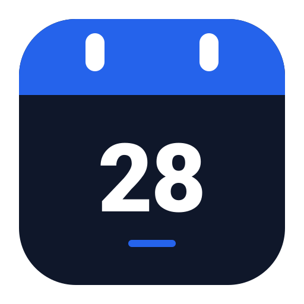

# Macro Deck 3 Calendar Plugin

[](https://macro-deck.app)
[](https://dotnet.microsoft.com/)
[](LICENSE)

An interactive, single-widget monthly calendar plugin built for **Macro Deck 3**. Unlike legacy plugins that required manually binding dozens of individual buttons and variables, this plugin provides a native, responsive deck widget rendered via Macro Deck's declarative UI system (`MacroDeck.Ui`).

<p align="center">
  
</p>

---

## ✨ Features

- **Single-Widget Model:** Drag and drop one widget onto your deck grid. Zero manual variable wiring required.
- **Header Navigation:** Interactive `‹` and `›` chevrons to browse months, with a centered title-case header (`September 2026`) that returns to today when tapped.
- **Interactive Day Selection:** Tap any date on the 42-cell grid to highlight and inspect it with a cyan selection ring.
- **Smart Auto-Navigation:** Tapping dimmed days from adjacent months automatically transitions the view to that month.
- **Today Highlighting:** The current system date is prominently illuminated in vibrant electric blue (`#2563eb`) with an inner sky-blue ring (`#93c5fd`).
- **Weekend Accents:** Sunday and Saturday column headers and dates feature subtle warm coral styling (`#fb7185`).
- **Footer Status Bar:** Displays the formatted active date (e.g., `Mon, Sep 28, 2026`) and an illuminated `TODAY` jump button when viewing past or future months.
- **External Action Bindings:** Exposes `next-month`, `prev-month`, and `today` actions to allow physical rotary dials, keyboard shortcuts, or deck buttons to drive calendar navigation.

---

## 📦 Installation

### From the Macro Deck Store (Recommended)
1. Open **Macro Deck 3**.
2. Navigate to **Store** / **Plugins**.
3. Search for **Calendar** by **jhnnr**.
4. Click **Install**.

### Manual Installation (.macroDeckPlugin)
1. Download the latest `com.jhnnr.calendar-x.x.x.macroDeckPlugin` from the [Releases](https://github.com/jhnnr/macrodeck3-calendar/releases) page.
2. In Macro Deck 3, go to **Settings** → **Plugins** → **Install from file** (or drag and drop the `.macroDeckPlugin` file directly into Macro Deck).

---

## 🚀 How to Use

1. Open your deck in the **Macro Deck 3** editor.
2. Select an empty tile or drag across multiple cells (e.g., **2×2**, **3×3**, or **4×4** for optimal layout).
3. Click **Add Widget** and select **Calendar** (`com.jhnnr.calendar::calendar`).
4. The calendar is live:
   - Tap **‹** or **›** to change months.
   - Tap the **Month Year** title or the bottom **TODAY** button to return to the current month.
   - Tap any day to select it.

---

## 🛠️ Actions Reference

You can optionally bind external buttons, dials, or triggers to control the calendar:

| Action ID | Name | Description |
| :--- | :--- | :--- |
| `next-month` | **Next Month** | Advances the calendar view by one month |
| `prev-month` | **Previous Month** | Moves the calendar view back by one month |
| `today` | **Current Month** | Resets view to current month and selects today's date |

---

## 💻 Building from Source

### Prerequisites
- [.NET 10.0 SDK](https://dotnet.microsoft.com/download/dotnet/10.0) (or later)
- [Macro Deck Plugin CLI](https://docs.macro-deck.app/cli/):
  ```bash
  dotnet tool install --global MacroDeck.Plugin.Cli --prerelease
  ```

### Build & Test Commands

```bash
# Clone the repository
git clone https://github.com/jhnnr/macrodeck3-calendar.git
cd macrodeck3-calendar

# Build the project
dotnet build src/macrodeck3-calendar/MacroDeckCalendar.csproj

# Run against the in-process stub host (headless test)
macrodeck-plugin run --project src/macrodeck3-calendar/MacroDeckCalendar.csproj --stub-host

# Run against a live Macro Deck 3 instance with hot reload
macrodeck-plugin run --project src/macrodeck3-calendar/MacroDeckCalendar.csproj --watch

# Run official plugin conformance test suite
macrodeck-plugin test --project src/macrodeck3-calendar/MacroDeckCalendar.csproj

# Build multi-platform runtimes and package artifact
macrodeck-plugin build --source src/macrodeck3-calendar --output artifacts --force
```

---

## 📄 License

This project is licensed under the [MIT License](LICENSE).
